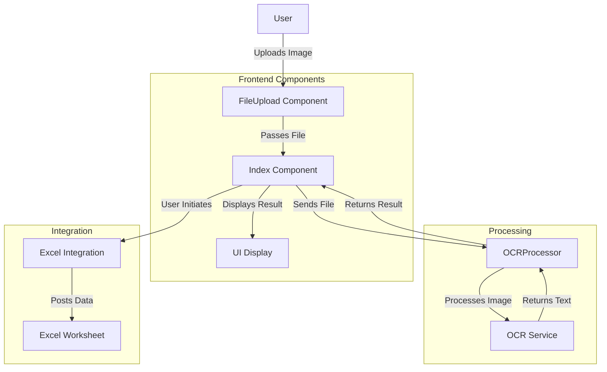

# Project Flowchart

## Flowchart Explanation

1. **User**: Initiates the process by uploading an image.
2. **FileUpload Component**: Handles the file upload interface.
3. **Index Component**: Main component that orchestrates the process.
4. **OCRProcessor**: Manages the OCR processing logic.
5. **OCR Service**: External service that performs the actual OCR.
6. **UI Display**: Shows the OCR result to the user.
7. **Excel Integration**: Handles posting data to Excel.
8. **Excel Worksheet**: The final destination for the processed data.

This flowchart illustrates the main components and data flow in the OCR and Excel integration project.